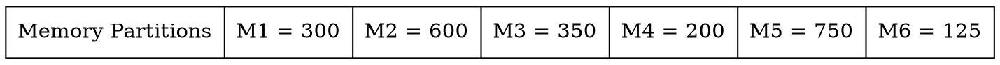
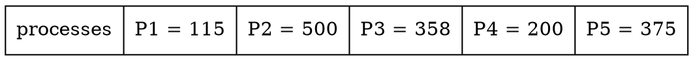

# HW8 主記憶體
[TOC]

## 8.1 
### **Explain the difference between internal and external fragmentation.**

**碎片**
> 內存空間沒有得到利用而導致的問題

**內部碎片**
> 當固定大小的內存塊分配給進程時，分配的內存與進程所需的空間或內存之間的差異。

**外部碎片**
> 當系統中的內存空間很容易滿足進程的需求，但是這個可用的內存空間是 ++不連續的++，所以不能進一步利用。

| 差異 |`內部碎片` internal fragmentation|`外部碎片`external fragmentation|
|----------| ---------------|--------- |
|1|當固定大小的內存塊分配給進程時，就會發生內部碎片。|當可變大小的內存塊動態分配給進程時，就會發生外部碎片。|
|2|這種類型的碎片主要發生在固定大小的分區分配給大小小於分區大小的進程時，由於分區中的其餘空間變得不可用。 |當系統中的內存空間很容易滿足進程的需求，但是這個可用的內存空間是不連續的，所以不能進一步利用。|
|3|分配的內存與進程所需的內存之間的差異稱為內部碎片。|非連續內存碎片之間的未使用內存空間太小而無法為新進程提供服務稱為外部碎片。|
|4|主要是指駐留在分配區域的分區中未使用的空間；正如名字所暗示的那樣。|主要是指內存中未使用的不連續的塊，無法滿足進程的要求。|
|5|可以使用最佳擬合塊來克服內部碎片的問題。|可以使用壓縮、分段和分頁來克服外部碎片的問題。|
|6|分頁受到內部碎片的影響。|First-fit 和 best-fit 受到外部碎片的影響。|

---
## 8.3 
### **Given six memory partitions of 300 KB, 600 KB, 350 KB, 200 KB, 750 KB, and 125 KB (in order), how would the first-fit, best-fit, and worst-fit algorithms place processes of size 115 KB, 500 KB, 358 KB, 200 KB, and 375 KB (in order)? Rank the algorithms in terms of how efficiently they use memory.**

**First - fit**
>| processes |M1|M2|M3|M4|M5|M6|
>|--|--|--|--|--|--|--|
>|P1 (115 put in 300)|185 (300 - 115)|600|350|200|750|125|
>|P2 (500 put in 600)|185|100  (600 - 500)|350|200|750|125|
>|P3 (358 put in 750)|185|100|350|200|392 (750 - 358)|125|
>|P4 (200 put in 350)|185|100|150 (350- 200)| 200| 392| 125|
>|P5 (375 put in 392)|185|100|150|200|17 (392 - 375)|125|

**Best - fit**
>| processes |M1|M2|M3|M4|M5|M6|
>|--|--|--|--|--|--|--|
>|P1 (115 put in 125)|300|600|350|200|750|10 (125 - 115)|
>|P2 (500 put in 600)|300|100  (600 - 500)|350|200|750|10|
>|P3 (358 put in 750)|300|100|350|200|392 (750 - 358)|10|
>|P4 (200 put in 200)|300|100|350| 0 (200 - 200)| 392| 10|
>|P5 (375 put in 392)|300|100|350|0|17 (392 - 375)|10|

**worst - fit**
>| processes |M1|M2|M3|M4|M5|M6|
>|--|--|--|--|--|--|--|
>|P1 (115 put in 750)|300|600|350|200|635 (750 - 115)|125|
>|P2 (500 put in 635)|300|600|350|200|135 (635 - 500)|125|
>|P3 (358 put in 600)|300|242 (600 - 358)|350|200|135|125|
>|P4 (200 put in 350)|300|242|150 (350 - 200)|200|135|125|
>|**P5 (375  must wait )**|||||||
---
## 8.4 
### Most system allow a program to allocate more memory to its address space during execution. Allocation of data in the heap segments of programs is an example of such allocated memory. What is required to support dynamic memory allocation in the following schemes?
大多數系統允許程序在執行期間為其地址空間分配更多內存。在程序的堆段中分配數據就是這種分配內存的一個例子。在以下方案中支持動態內存分配需要什麼？

a. Contiguous memory allocation: 
b. Pure segmentation: 
c. Pure paging:

> a. 當分配的內存空間中沒有足夠的空間時，連續內存分配可能需要重新定位整個程序。
> b. 如果段不能在分配的內存空間中增長，純分段也可能需要重新定位段。
> c. 在這種情況下，純分頁是最好的方案，因為無需重新定位即可分配頁面（非連續）。

---
## 8.5 
### Compare the memory organization schemes of contiguous memory allocation, pure segmentation, and pure paging with respect to the following issues:
比較連續內存分配 / 純分段 / 純分頁的主內存組織方案在跨進程共享代碼的外部 / 內部碎片能力方面

a. external fragmentation : 
b. internal fragmentation : 
c. ability to share code across processes:

**a. external fragmentation**
> **具有固定大小分區的連續分配** : 
> 不受外部碎片的影響。
> **具有可變大小分區的連續分配** : 
> 受外部碎片影響。
> **純分段** : 
> 受外部碎片影響。
> **純分頁** : 
> 不受外部碎片的影響。

**b. internal fragmentation**
> **具有固定大小分區的連續分配** : 
> 受內部碎片的影響。
> **具有可變大小分區的連續分配** : 
> 不受內部碎片影響。
> **純分段** : 
> 不受內部碎片影響。
> **純分頁** : 
> 受內部碎片的影響。

**c. ability to share code across processes**
> **具有固定大小分區的連續分配** : 
> 不支持跨進程的代碼共享。
> **具有可變大小分區的連續分配** : 
> 不支持跨進程的代碼共享。
> **純分段** : 
> 支持跨進程代碼共享。但是，我們必須小心確保進程不會在同一段中混合代碼和數據。
> **純分頁** : 
> 支持跨進程代碼共享。如純分段，我們必須確保進程不會在同一頁中混合代碼和數據。

---
## 8.11 
### Program binaries in many systems are typically structured as follows. Code is stored starting with a small fixed virtual address, such as 0. The code segment is followed by the data segment that is used for storing the program variables. When the program starts executing, the stack is allocated at the other end of the virtual address space and is allowed to grow towards lower virtual addresses. What is the significance of the above structure on the following schemes:

許多系統中的程序二進制文件通常結構如下。代碼以一個小的、固定的虛擬地址開始存儲，例如 0. 代碼段之後是用於存儲程序變量的數據段。當程序開始執行時，堆棧被分配在虛擬地址空間的另一端，並允許向較低的虛擬地址增長。這種結構對於以下方案的意義是什麼？

a. contiguous-memory allocation: 
b. pure segmentation: 
c. pure paging:

> **contiguous-memory allocation**
> 連續內存分配要求操作系統在程序開始執行時將虛擬地址空間的整個範圍分配給程序。這可能比進程的實際內存需求大得多。
> **pure segmentation**
> 純分段為操作系統提供了靈活性，可以在程序啟動時為每個分段分配一個小範圍，並在需要時擴展該分段。
> **pure paging**
> 純分頁不需要操作系統在啟動時為進程分配最大的虛擬地址空間，但仍需要操作系統分配一個跨越程序所有虛擬地址空間的大頁表。當程序需要擴展棧或堆時，需要分配一個新的頁，但相應的頁表項是預先分配好的
---
## 8.12 
### Assuming a 1-KB page size, what are the page numbers and offsets for the following address references (provided as decimal numbers):
a. 3085
b. 42095
c. 215201
d. 650000
e. 2000001

> **Answer size = 2^n = 1KB = 1024 = 2^10**
> **偏移量 n = 10** 
> 
> **解決步驟：**
> **1. 轉換邏輯地址：十進制到二進制**
> **2. 將二進制地址拆分為 2 部分（頁號，偏移量），偏移量：n 位**
> **3. 將偏移量和頁碼：二進制轉換為十進制**

**Tips:book:**
>Page number = logical address / page size[color=#FF9A78]
>Offset = logical address mod page size 

>**a. 3085**
>**Page number**
>3085 / 1024 = 3
>**Offset**
>3085 mod 1024 = 13

>**b. 42095**
>**Page number**
>42095 / 1024 = 41
>**Offset**
>42095 mod 1024 = 111

>**c. 215201**
>**Page number**
>215201 / 1024 = 210
>**Offset**
>215201 mod 1024 = 161

>**d. 650000**
>**Page number**
>650000 / 1024 = 634
>**Offset**
>650000 mod 1024 = 784

>**e. 2000001**
>**Page number**
>2000001 / 1024 = 1953
>**Offset**
>2000001 mod 1024 = 129
---
## 8.15 
### Consider a logical address space of 256 pages with a 4-KB page size, mapped onto a physical memory of 64 frames.
a. How many bits are required in the logical address?
b. How many bits are required in the physical address?

> **a. How many bits are required in the logical address?**
> Logical address space = number of pages * page size = 256 * 4 * 2^10 = 2^20
> **logical address has to be 20 bits.**

> **b. How many bits are required in the physical address?**
> Size of physical memory = number of frames * size of frame. = 64 * 4 * 2^10 = 2^18
> **physical address has to be 18 bits.**

---
## 8.16 
### Consider a computer system with a 32-bit logical address and 4-KB page size. The system supports up to 512-MB of physical memory. How many entries are there in each of the following?
a. A conventional single-level page table
b. An inverted page table

> **a. A conventional single-level page table**
> ++Total virtual memory size++ = 2^32 
> ++Size of a single page++ = 4KB = 2^12 
> ++Total number of pages of virtual memory++ = 2^32 / 2^12 = 2^20
> **So page table will be having 2^20 entries**

> **b. An inverted page table**
> ++Total physical memory++ = 2^29=512MB
> ++page size = frame size++ = 2^12
> ++Total number of frames in physical memory++ = 2^29 / 2^12 = 2^17
> **So inverted page table will be having 2^17 entries**

---
## 8.20 
### Consider the following segment table:
What are the physical addresses for the following logical addresses?
a. 0,430 
b. 1,10
c. 2,500
d. 3,400
e. 4,112

> |0,430|219 + 430 = 649|
> |--|--|
> |1,10|2300 + 10 = 2310|
> |2,500|invalid|
> |3,400|1327 + 400 = 1727|
> |4,112|invalid|
---
## 8.23 
### Compare the segmented paging scheme with the hashed page table scheme for handling large address spaces. Under what circumstances in one scheme preferable to the other?
將分段分頁方案與散列頁表方案進行比較以處理大地址空間。在什麼情況下一種方案優於另一種方案？
> 當程序只佔用其大虛擬地址空間的一小部分時，散列頁表可能是首選，因為它的
> 大小較小。然而，散列頁表的缺點是由於將多個頁面映射到同一個散列頁表條目
> 時的衝突而出現的問題。如果許多頁面映射到同一個條目，則遍歷與該哈希表條
> 目對應的列表可能會產生大量開銷；這種開銷在分段分頁方案中是最小的，其中
> 每個頁表條目只維護關於一頁的信息。